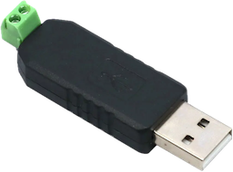

# Python library to control XY Screens projector screens and lifts

![Python][python-shield]
[![GitHub Release][releases-shield]][releases]
[![Licence][license-shield]][license]
[![Maintainer][maintainer-shield]][maintainer]  
[![Github Sponsors][github-shield]][github]
[![PayPal][paypal-shield]][paypal]
[![BuyMeCoffee][buymecoffee-shield]][buymecoffee]
[![Patreon][patreon-shield]][patreon]

## Introduction

This python library lets you control XY Screens projector screens and lifts over the RS-485
interface.

XY Screens is an OEM manufacturer of projector screens and lifts, their devices are sold around the
world under various brand names.

## Features

* Calculates screen position
* Synchronous and asynchronous methods
* Uses Callbacks for asynchronous methods

## Hardware

I use a cheap USB RS-485 controller to talk to the projector screen where position 5 of the RJ25
connector is connected to D+ and position 6 to the D-.

See the documentation of your specific device on how to wire yours correctly.

## Protocol

If your devices follows the following protocol it's supported by this Python library:

2400 baud 8N1  
Up command  : 0xFF 0xAA 0xEE 0xEE 0xDD  
Down command: 0xFF 0xAA 0xEE 0xEE 0xEE  
Stop command: 0xFF 0xAA 0xEE 0xEE 0xCC

## Supported projector screens and lifts

The following projector screens is known to work:

* iVisions Electro M Series

The following projector screens and lifts are not tested but use the same protocol according to the
documentation:

* iVisions Electro L/XL/Pro/HD Series
* iVisions PL Series projector lift
* Elite Screens
* KIMEX
* DELUXX

Please let me know if your projector screen or projector lift works with this Python library so I
can improve the overview of supported projector screens and lifts.

## Installation

You can install the Python XY Screens library using the Python package manager PIP:

`pip3 install xyscreens`

## `xyscreens` CLI

You can use the Python XY Screens library directly from the command line to move your screen up or
down or to stop the screen using the following syntax:

Move the screen down: `python3 -m xyscreens <serial port> <time> down`  
Stop the screen: `python3 -m xyscreens <serial port> <time> stop`  
Move the screen up: `python3 -m xyscreens <serial port> <time> up`

Where `<time>` is the time in seconds to move the screen down, respectively up. The process will
wait till the screen is down/up and show the progress.

### Troubleshooting

You can add the `--debug` flag to any CLI command to get a more details on what's going on. Like so:

`python3 -m xyscreens <serial port> <time> down --debug`

## Support my work

Do you enjoy using this Python library? Then consider supporting my work using one of the following
platforms, your donation is greatly appreciated and keeps me motivated:

[![Github Sponsors][github-shield]][github]
[![PayPal][paypal-shield]][paypal]
[![BuyMeCoffee][buymecoffee-shield]][buymecoffee]
[![Patreon][patreon-shield]][patreon]

## Hire me

If you're in need for a freelance Python developer for your project please contact me, you can find
my email address on [my GitHub profile](https://github.com/rrooggiieerr).

[python-shield]: https://img.shields.io/badge/python-3670A0?style=for-the-badge&logo=python&logoColor=ffdd54
[releases]: https://github.com/rrooggiieerr/xyscreens.py/releases
[releases-shield]: https://img.shields.io/github/v/release/rrooggiieerr/xyscreens.py?style=for-the-badge
[license]: ./LICENSE
[license-shield]: https://img.shields.io/github/license/rrooggiieerr/xyscreens.py?style=for-the-badge
[maintainer]: https://github.com/rrooggiieerr
[maintainer-shield]: https://img.shields.io/badge/MAINTAINER-%40rrooggiieerr-41BDF5?style=for-the-badge
[paypal]: https://paypal.me/seekingtheedge
[paypal-shield]: https://img.shields.io/badge/PayPal-00457C?style=for-the-badge&logo=paypal&logoColor=white
[buymecoffee]: https://www.buymeacoffee.com/rrooggiieerr
[buymecoffee-shield]: https://img.shields.io/badge/Buy%20Me%20a%20Coffee-ffdd00?style=for-the-badge&logo=buy-me-a-coffee&logoColor=black
[github]: https://github.com/sponsors/rrooggiieerr
[github-shield]: https://img.shields.io/badge/sponsor-30363D?style=for-the-badge&logo=GitHub-Sponsors&logoColor=ea4aaa
[patreon]: https://www.patreon.com/seekingtheedge/creators
[patreon-shield]: https://img.shields.io/badge/Patreon-F96854?style=for-the-badge&logo=patreon&logoColor=white
